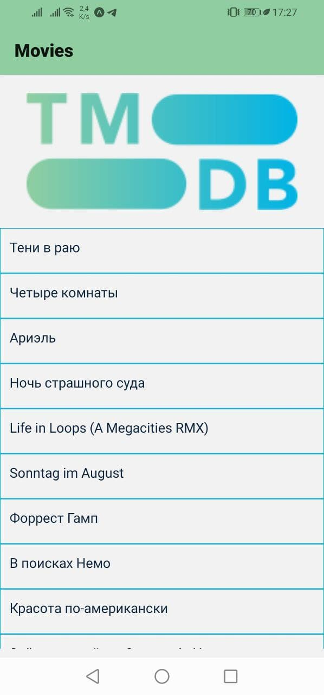

## Mobile App for movies

The application serves movies from [TMDB database](https://www.themoviedb.org/documentation/api) using their API and displays it as a list.
There is also a detailed view, where a movie's description, rating and poster are displayed.  
For example:  

